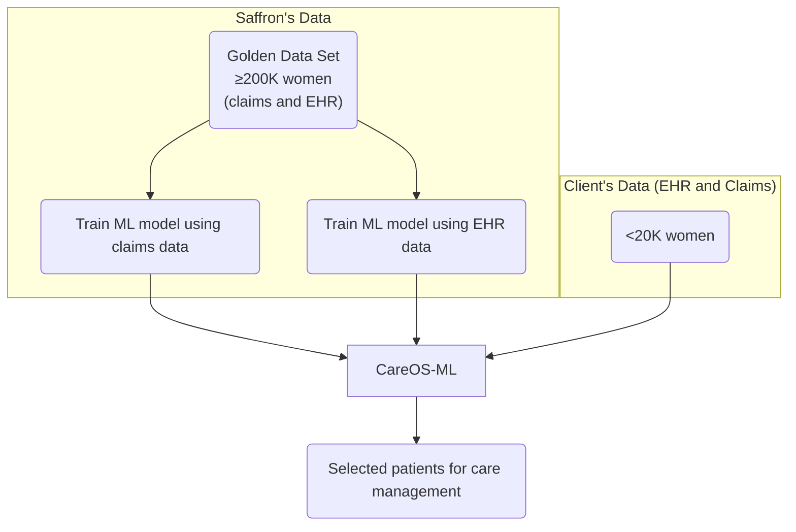

# CareOS-ML: Identifying Undiagnosed Perimenopause and Menopause

## The Problem

Perimenopause and menopause affect virtually all women, yet remain systematically under-documented. Patients present with vasomotor symptoms, sleep disturbances, mood changes, and cognitive complaints—but often lack a formal diagnosis connecting these experiences to hormonal transition. The result: missed opportunities for evidence-based management and incomplete risk adjustment.

This documentation gap persists because symptoms present gradually, overlap with other conditions, and compete for attention in time-limited visits. Standard case-finding approaches fail here: rule-based alerts generate excessive false positives, while supervised machine learning requires labeled datasets that exclude the very patients we're trying to find.

**Our solution:**

## Our Approach

**CareOS-ML** combines a base model trained on large datasets with client-specific calibration, producing predictions tuned to the characteristics of each clinic or health system. Our approach enables partnerships with organizations that would otherwise lack sufficient data for standalone model development. A regional clinic with 5,000 eligible patients benefits from patterns learned across 200,000+ patients while still receiving predictions calibrated to their specific context.

## How It Works

**1. Base models trained on diverse populations.** We train our models on Saffron's Golden Data Set (≥200,000 women with linked claims and EHR data), learning generalizable patterns for perimenopause and menopause detection across diverse populations and care settings. We then incorporate each partner's local data (<20,000 women is sufficient) to adjust for site-specific documentation practices, coding conventions, patient demographics, and care patterns.

**2. Learning from incomplete labels.** Traditional models require confirmed diagnoses for training. In perimenopause, this creates circularity—the undocumented cases are excluded from model development. Our approach learns jointly from patients with confirmed diagnoses and patients with suggestive patterns but no formal documentation, identifying which combinations of symptoms, medications, labs, and utilization patterns predict the condition regardless of whether it was coded.

**3. Quantifying uncertainty.** Most models produce single-number predictions: "78% probability of undiagnosed perimenopause." But clinical utility depends on knowing whether that estimate is reliable. Two patients scored at 78% may have very different underlying certainty—one with rich documentation and clear symptom patterns, another with sparse records and ambiguous presentation. Our model distinguishes these cases, providing uncertainty ranges that inform clinical prioritization.

**4. Optimizing for precision.** When surfacing patients for provider review, there's an inherent volume-precision tradeoff. We optimize for high-confidence, high-probability cases—delivering a focused worklist of patients likely to benefit from intervention rather than a large list with high false-positive burden. This preserves provider trust and concentrates effort where it matters.

## Differentiation

| Approach | Limitation |
|----------|------------|
| Rule-based flags | High false-positive rates; no uncertainty quantification; misses atypical presentations |
| Supervised ML | Requires labeled data, excluding undocumented cases; treats all predictions with equal confidence |
| Deep learning | Poor probability calibration; no meaningful uncertainty estimates; black-box explanations; requires large local datasets |
| **Our approach** | Learns from labeled and unlabeled cases; probability estimates that match real-world rates with uncertainty ranges; interpretable feature contributions; adapts to small partner populations |

The key differentiator is calibrated uncertainty. When the model expresses high confidence, subsequent chart review confirms the prediction at correspondingly high rates. This calibration enables clinical teams to set actionable thresholds—for example, reviewing only cases where both probability and confidence exceed defined cutoffs.

## Clinical Workflow Integration

Our system produces a prioritized worklist of patients with likely undiagnosed perimenopause or menopause. Each patient record includes:

- Probability estimate with confidence interval
- Contributing evidence from claims and EHR (symptoms, labs, medications, utilization patterns)
- Suggested management plan aligned with current guidelines

Providers review a curated set of high-yield cases rather than sifting through marginal candidates. We update predictions daily, ensuring newly presenting patients are identified promptly.

## The Confidence Advantage

Consider two patients, both scored at 80% probability:

| | Patient A | Patient B |
|---|-----------|-----------|
| Model confidence | High | Low |
| Interpretation | Clear symptom pattern, rich documentation | Sparse records, ambiguous presentation |
| Implied probability range | 75–85% | 50–95% |
| Clinical action | Prioritize for outreach | Defer until more information available |

Without uncertainty quantification, these patients appear identical. With it, clinical resources are allocated appropriately—intervening where confidence is high, gathering additional information where it's not.

## Summary

Our approach addresses a genuine gap in women's health by:

- Learning from the inherent structure of incomplete documentation rather than requiring exhaustive labeling
- Providing uncertainty estimates that map directly to clinical decision thresholds
- Delivering precision-optimized worklists that preserve provider trust and concentrate effort on actionable cases
- Enabling partnerships with organizations of any size through base models that adapt to local data characteristics

Our infrastructure scales to populations of one million patients with daily refresh cycles, while our adaptive architecture allows partners with as few as 5,000–20,000 patients to benefit from models trained on 200,000+.

---

*Technical methodology detailed in companion document: "Assessment: Semi-Supervised Bayesian Ensemble with Learned Calibration."*
